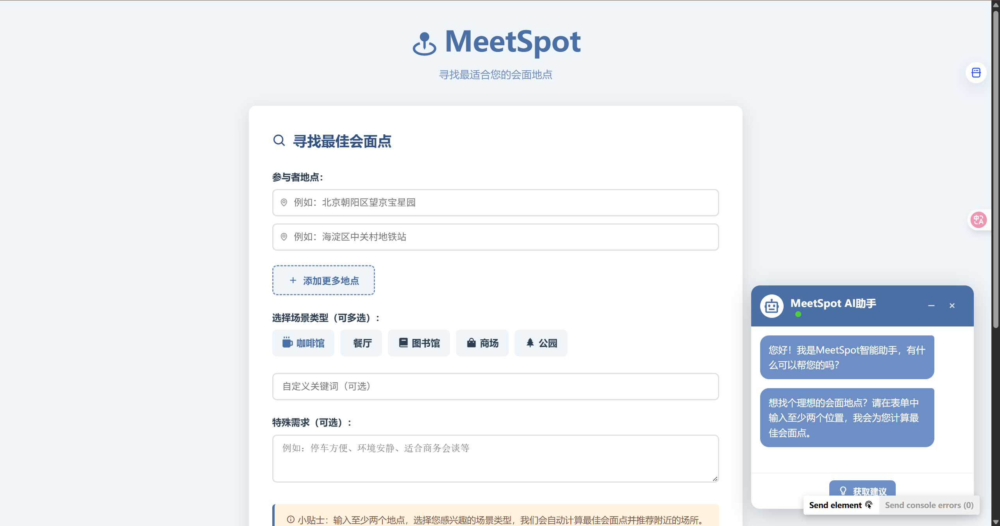
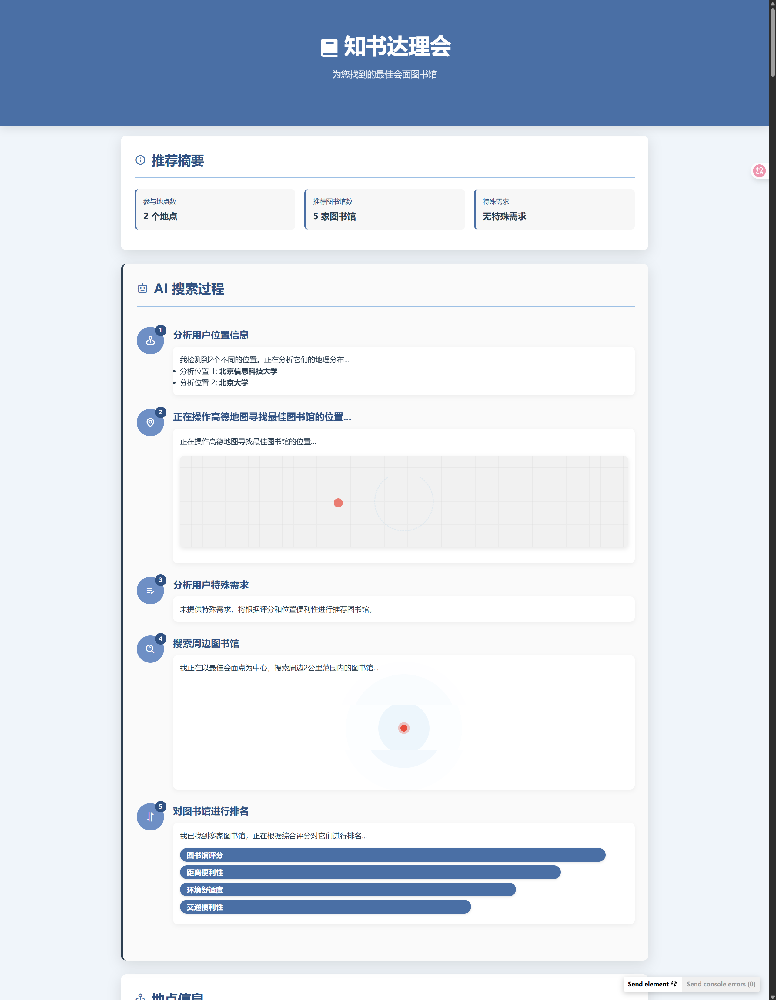
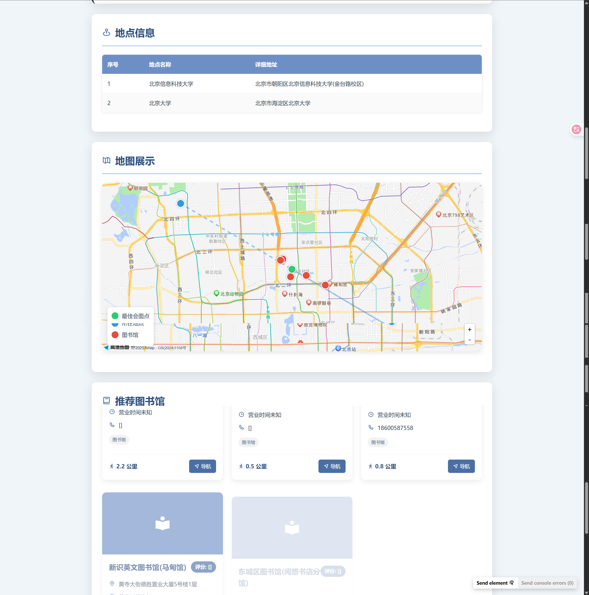
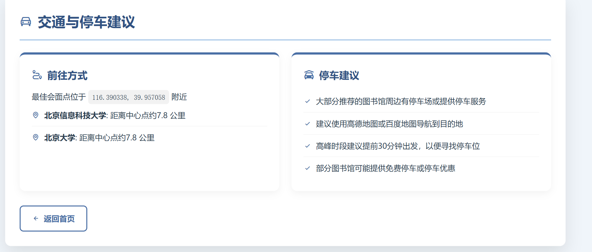
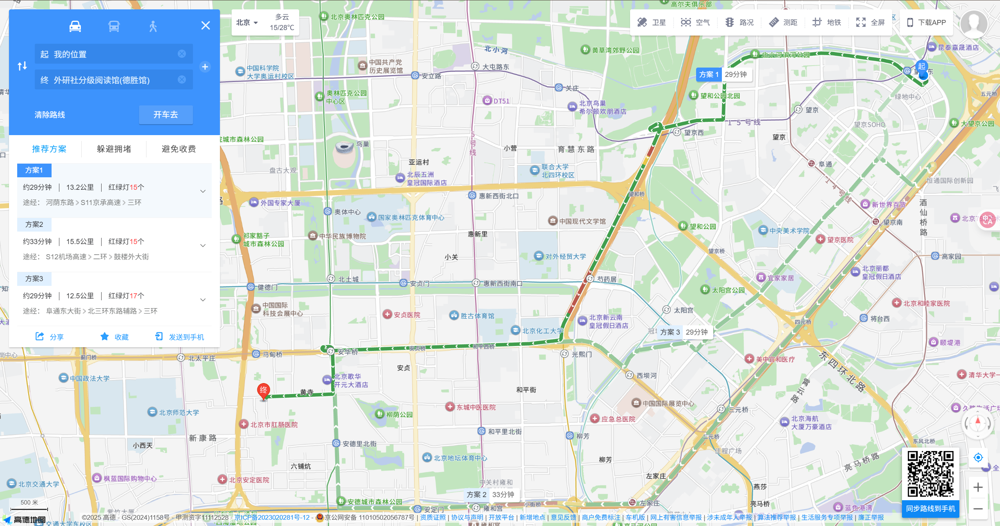

# MeetSpot (聚点) - 智能会面点推荐系统

<p align="center">
  
</p>

 MeetSpot (聚点) 是一个智能的会面地点推荐系统，旨在帮助用户根据多个参与者的位置和特定需求，快速找到最合适的会面场所。无论是寻找安静的咖啡馆进行商务会谈，还是热闹的餐厅朋友聚餐，或是适合学习的图书馆，聚点都能为您提供智能化的推荐。

## 🔍 项目展示

<p align="center">
  <a href="https://www.bilibili.com/video/BV1d1jMzrEUk/?vd_source=ac00554d8e1f118822ccd0405e3f6f15">
    <strong>📹 点击查看项目演示视频</strong>
  </a>
</p>

<p align="center">
  <em>项目演示 - 多地点会面场所智能推荐过程</em>
</p>

<p align="center">
  
</p>

<p align="center">
  
</p>

<p align="center">
  
</p>

<p align="center">
  
</p>

## ✨ 主要功能

- **智能中心点计算**: 根据所有参与者的位置，自动计算出最公平、最便捷的会面中心区域。
- **多样化场所推荐**: 支持推荐多种类型的场所，包括但不限于：
  - 咖啡馆 ☕
  - 餐厅 🍜
  - 图书馆 📚
  - 商场 🛍️
  - 公园 🌳
  - 电影院 🎬
  - 篮球场 🏀
  - 以及更多自定义场所类型！
- **个性化需求满足**: 用户可以输入特殊需求，如"停车方便"、"环境安静"、"适合商务"、"有Wi-Fi"等，系统会在推荐时优先考虑这些因素。
- **动态主题结果页**: 根据用户选择的场所类型，推荐结果页面会自动更换匹配的主题颜色和图标，提供更沉浸式的体验。
- **交互式地图展示**:
  - 在地图上清晰标记所有参与者位置、计算出的最佳会面中心点以及推荐的场所。
  - 提供到推荐场所的导航链接（通过高德地图）。
- **详细场所信息**: 展示推荐场所的名称、地址、评分、营业时间、联系电话、标签和距离中心点的距离。
- **AI搜索过程模拟**: 以动画形式展示AI助手分析需求、搜索地点、进行排序的"思考"过程，增加趣味性。
- **Web用户界面**: 提供简洁易用的Web界面 (`meetspot_finder.html`) 进行地点输入和需求选择。
- **API接口**: 提供 `/api/find_meetspot` 接口，方便与其他系统集成。

## 🚀 工作原理

1. **用户输入**: 用户通过前端界面输入至少两个参与者的位置描述、选择期望的场所类型（可多选或自定义关键词）以及任何特殊需求。
2. **后端接收**: FastAPI 构建的后端服务器接收请求。
3. **地理编码**: 调用高德地图API将用户输入的地点描述转换为精确的经纬度坐标。
4. **中心点计算**: 根据所有参与者的经纬度，计算出几何中心点作为初步的会面区域中心。
5. **POI搜索**: 以中心点为圆心，结合用户选择的场所类型（关键词）和高德地图的分类编码，在一定半径内（如5公里）搜索相关的兴趣点 (POI)。
6. **智能排序与筛选**:
   - 综合考虑场所的评分、与中心点的距离、是否满足用户特殊需求等因素。
   - 对搜索到的场所进行打分和排序。
7. **动态结果生成**:
   - 选取评分最高的若干个场所作为推荐结果。
   - 生成一个包含详细推荐信息、交互式地图的HTML页面。
8. **前端展示**: 将生成的HTML页面URL返回给前端，用户在新标签页中查看推荐结果。

## 🛠️ 技术栈

- **后端**: Python, FastAPI, Uvicorn
- **核心推荐逻辑**: `app.tool.meetspot_recommender.CafeRecommender` (虽然类名叫CafeRecommender，但已具备通用场所推荐能力)
- **智能代理框架**: OpenManus (项目结构中包含 `app.agent` 和 `app.flow` 等相关模块)
- **地理服务**: 高德地图开放平台API (地理编码、POI搜索、地图展示)
- **前端**: HTML, CSS, JavaScript (Boxicons 图标库)
- **数据处理**: Pydantic (数据验证与模型定义)
- **异步处理**: `asyncio`, `aiohttp`

## ⚙️ 安装与配置

1. **克隆仓库**:

   ```
   git clone https://github.com/JasonRobertDestiny/MeetSpot.git
   cd MeetSpot
   ```

2. **创建并激活虚拟环境**:

   ```
   python -m venv .venv
   # Windows
   .venv\Scripts\activate
   # macOS/Linux
   source .venv/bin/activate
   ```

3. **安装依赖**:

   ```
   pip install -r requirements.txt
   ```

4. **配置API密钥**:

   - 在项目根目录下找到 `config` 文件夹。

   - 在 `config` 文件夹内复制 `config.toml.example` 为 `config.toml`。

   - 编辑 `config.toml`，添加高德地图的API Key和安全密钥 (JScode)：

     ```
     # config/config.toml
     [amap]
     api_key = "YOUR_AMAP_API_KEY"  # 替换为你的高德Web服务API Key
     security_js_code = "YOUR_AMAP_SECURITY_JS_CODE" # 替换为你的高德地图JS API安全密钥
     
     # 如果使用OpenAI或其他LLM服务，也在此配置
     # [openai]
     # api_key = "sk-YOUR_OPENAI_API_KEY"
     # base_url = "YOUR_OPENAI_API_BASE_URL_IF_NEEDED"
     ```

   - **重要**: `api_key` 用于后端调用高德Web服务API（如地理编码、POI搜索），`security_js_code` 用于前端JS API加载地图时的安全校验。请确保从高德开放平台获取这两种凭证。

## ▶️ 运行项目

在项目根目录下运行以下命令启动Web服务器：

```
python web_server.py
```

服务器默认会在 `http://127.0.0.1:8000` (或 `http://0.0.0.0:8000`) 启动。

## 💡 使用方法

1. 打开浏览器，访问 `http://localhost:8000`。
   - (如果服务器绑定在 `0.0.0.0`，你也可以通过你的局域网IP地址访问)。
2. 在 "参与者地点" 部分，输入至少两个会面参与者的起始位置。可以点击 "添加更多地点" 按钮增加输入框。
3. 在 "选择场景类型" 部分，勾选您感兴趣的场所类型（如咖啡馆、图书馆、餐厅等）。您也可以在下方的输入框中填写更具体的自定义关键词。
4. 在 "特殊需求" 输入框中，填写您的额外要求，例如"安静"、"有投影仪"、"适合儿童"等。
5. 点击 "查找最佳会面点" 按钮。
6. 系统会进行计算和搜索，并在处理完成后自动跳转到包含推荐结果和地图的新页面。

## 📂 项目结构 (概览)

```
MeetSpot/
├── app/                      # 核心应用逻辑
│   ├── agent/                # OpenManus智能代理相关实现
│   ├── flow/                 # 任务流定义
│   ├── prompt/               # 提示工程相关模板
│   ├── tool/                 # 工具定义，核心为 meetspot_recommender.py
│   ├── config.py             # 应用配置加载
│   ├── logger.py             # 日志配置
│   └── ...
├── config/                   # 配置文件目录
│   └── config.toml.example   # 配置文件示例
├── docs/                     # 文档和资源
│   ├── images/               # 图片资源
│   │   ├── logo.png
│   │   ├── show1.png
│   │   ├── show2.png
│   │   ├── show3.png
│   │   └── show4.png
│   └── videos/               # 视频资源
├── logs/                     # 日志文件存储目录
├── workspace/                # 前端静态文件和用户生成的内容
│   ├── js_src/               # 后端生成的HTML推荐结果页面存放于此
│   ├── meetspot_finder.html  # 主要的前端输入页面
│   └── index.html            # (可选) 项目首页或旧版入口
├── tests/                    # 测试代码
├── .venv/                    # Python虚拟环境
├── main.py                   # 命令行交互入口 (如果保留)
├── web_server.py             # FastAPI Web服务器主程序
├── requirements.txt          # Python依赖包列表
└── README.md                 # 本文件
```

## 🔮 未来展望

- **用户账户与历史记录**: 允许用户保存常用地点和查询历史。
- **更精细的筛选条件**: 例如按人均消费、营业状态（如"营业中"）等进行筛选。
- **多语言支持**: 提供英文或其他语言界面。
- **路线规划集成**: 直接在结果页显示到推荐地点的多参与者路线方案。
- **实时交通信息**: 结合实时交通状况优化推荐。
- **移动端优化**: 进一步优化移动设备上的显示和交互体验。

## 🤝 贡献

欢迎对 MeetSpot (聚点) 项目做出贡献！如果您有任何建议、发现bug或希望添加新功能，请随时通过以下方式参与：

1. Fork 本仓库。
2. 创建您的特性分支 (`git checkout -b feature/AmazingFeature`)。
3. 提交您的更改 (`git commit -m 'Add some AmazingFeature'`)。
4. 将您的更改推送到分支 (`git push origin feature/AmazingFeature`)。
5. 开启一个 Pull Request。

## 📜 许可证

本项目采用 [MIT许可证](LICENSE)。

希望这个README能帮助您更好地了解和使用MeetSpot (聚点)！
