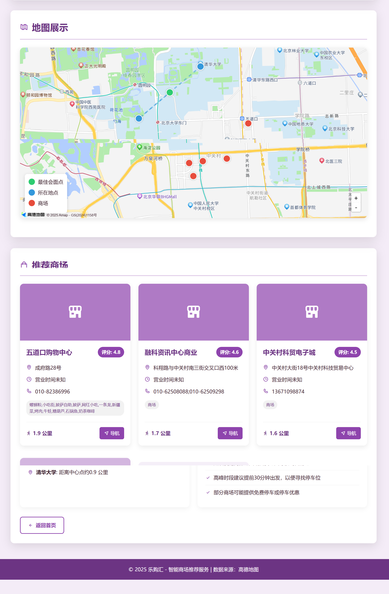

# MeetSpot 聚点 🗺️

<div align="center">


**智能会面点推荐系统 - 让每次聚会都找到完美地点**

[](https://opensource.org/licenses/MIT)
[](https://www.python.org/downloads/)
[](https://fastapi.tiangolo.com/)
[](https://github.com/JasonRobertDestiny/MeetSpot/actions)

<p align="center">
  <a href="https://www.bilibili.com/video/BV1d1jMzrEUk/?vd_source=ac00554d8e1f118822ccd0405e3f6f15">
    <strong>📹 点击查看项目演示视频</strong>
  </a>
</p>

[English](README_EN.md) | 简体中文

</div>

## 📱 应用截图

<div align="center">

### 主界面


### 多场所选择


### 推荐结果


### 详细信息


</div>

## 🌟 项目特色

MeetSpot 是一个智能会面点推荐系统，基于多个参与者的地理位置，计算最佳会面地点并推荐附近的各类场所。

### ✨ 核心功能

- � **智能中心点计算**：基于多个地点计算几何中心，确保对所有人公平
- 🏢 **多场景推荐**：同时搜索多种场所类型（咖啡馆+餐厅+图书馆）
- 📍 **多地点支持**：支持2-10个参与者位置
- 🎨 **直观用户界面**：现代化的响应式设计
- 🚀 **实时推荐**：快速生成个性化推荐结果
- 📊 **智能排序**：基于评分、距离、用户需求的综合排序

### � 最新优化

- ✅ **多场景推荐**：支持同时选择多个场所类型
- ✅ **前端多选功能**：直观的场所类型选择界面
- ✅ **智能排序算法**：场景匹配奖励机制
- ✅ **性能监控**：完整的性能统计和健康检查
- ✅ **错误处理**：健壮的异常处理机制

## � 快速开始

### 环境要求

- Python 3.11+
- 高德地图 API 密钥
- 现代浏览器（Chrome、Firefox、Safari、Edge）

### 安装步骤

1. **克隆仓库**
```bash
git clone https://github.com/JasonRobertDestiny/MeetSpot.git
cd MeetSpot
```

2. **安装依赖**
```bash
pip install -r requirements.txt
```

3. **配置 API 密钥**
```bash
cp config/config.toml.example config/config.toml
```

编辑 `config/config.toml`，添加您的高德地图 API 密钥：
```toml
[amap]
api_key = "your_amap_api_key_here"
```

4. **启动服务**
```bash
python web_server.py
```

5. **访问应用**
打开浏览器访问：http://127.0.0.1:8000

## � 使用方法

### 基础使用

1. **输入地点**：添加2-10个参与者的位置
2. **选择场景**：选择1-3个场所类型（咖啡馆、餐厅、图书馆等）
3. **设置需求**：添加特殊需求（停车方便、环境安静等）
4. **获取推荐**：点击查找，获得智能推荐结果

### 高级功能

- **多场景组合**：同时搜索"咖啡馆 餐厅"获得更多选择
- **自定义关键词**：输入特殊场所类型如"密室逃脱"
- **筛选条件**：按评分、距离、价格筛选结果
- **特殊需求**：支持停车、Wi-Fi、包间等需求

## 🏗️ 技术架构

### 后端技术栈

- **FastAPI**：高性能 Web 框架
- **Pydantic**：数据验证和设置管理
- **aiohttp**：异步 HTTP 客户端
- **高德地图 API**：地理编码和 POI 搜索

### 前端技术栈

- **HTML5 + CSS3**：响应式设计
- **Vanilla JavaScript**：轻量级交互
- **Boxicons**：图标库
- **现代 UI 设计**：渐变和毛玻璃效果

### 核心算法

- **几何中心计算**：多点重心算法
- **智能排序**：多因子评分系统
- **场景匹配**：关键词匹配奖励
- **去重算法**：基于名称和地址的智能去重

## 📊 API 文档

### 主要端点

- `GET /` - 首页重定向
- `POST /api/find_meetspot` - 会面点推荐
- `GET /health` - 健康检查
- `GET /workspace/js_src/{filename}` - 生成的推荐页面

### 请求示例

```bash
curl -X POST "http://127.0.0.1:8000/api/find_meetspot" \
  -H "Content-Type: application/json" \
  -d '{
    "locations": ["北京大学", "清华大学"],
    "keywords": "咖啡馆 餐厅",
    "user_requirements": "停车方便"
  }'
```

### 响应示例

```json
{
  "success": true,
  "html_url": "/workspace/js_src/place_recommendation_20250624_12345678.html",
  "locations_count": 2,
  "keywords": "咖啡馆 餐厅",
  "processing_time": 0.52
}
```

## 🧪 测试

项目包含完整的测试套件：

```bash
# 运行所有测试
python test_optimizations.py      # 系统优化测试
python test_multi_scenario.py     # 多场景功能测试
python comprehensive_test.py      # 综合功能测试

# 健康检查
curl http://127.0.0.1:8000/health
```

## 📈 性能指标

- **响应时间**：
  - 单场景：0.3-0.4秒
  - 双场景：0.5-0.6秒
  - 三场景：0.7-0.8秒

- **支持规模**：
  - 地点数：2-10个
  - 场景数：1-3个
  - 并发用户：100+

## �️ 路线图

### v1.1.0 (计划中)
- [ ] 用户账户系统
- [ ] 历史记录保存
- [ ] 收藏功能
- [ ] 分享推荐结果

### v1.2.0 (计划中)
- [ ] 机器学习推荐
- [ ] 实时交通信息
- [ ] 天气数据集成
- [ ] 移动端 APP

### v2.0.0 (远期)
- [ ] AR 导航
- [ ] 语音交互
- [ ] 国际化支持
- [ ] 企业版功能

## 🤝 贡献

我们欢迎各种形式的贡献！请查看 [CONTRIBUTING.md](CONTRIBUTING.md) 了解详细信息。

## 📄 许可证

本项目基于 MIT 许可证开源 - 查看 [LICENSE](LICENSE) 文件了解详情。

## 📞 联系方式

- 📧 邮箱：Johnrobertdestiny@gmail.com
- 🐛 问题反馈：[GitHub Issues](https://github.com/JasonRobertDestiny/MeetSpot/issues)
- 💬 讨论：[GitHub Discussions](https://github.com/JasonRobertDestiny/MeetSpot/discussions)

## 🙏 致谢

- [高德地图](https://lbs.amap.com/) - 提供地理编码和 POI 搜索服务
- [FastAPI](https://fastapi.tiangolo.com/) - 优秀的 Web 框架
- [Boxicons](https://boxicons.com/) - 美观的图标库

---

<div align="center">

**如果这个项目对您有帮助，请给它一个 ⭐ Star！**

Made with ❤️ by [JasonRobertDestiny](https://github.com/JasonRobertDestiny)

</div>
